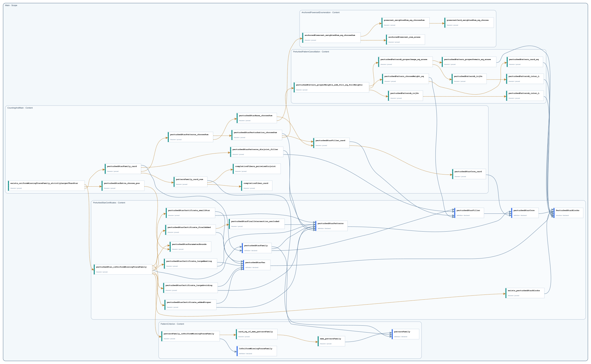

# Complete Declaration Graph

This catalog contains the current committed head of every active public and private declaration. It excludes deleted declarations and revision history.

- Declarations: `45`
- Public: `24`
- Private: `21`

## Dependency graph

The SVG may collapse duplicate Statement/Proof pairs for readability; the JSON document preserves both stage-specific edges.

## Declarations

| Node | Declaration | Visibility | Kind | Status |
| --- | --- | --- | --- | --- |
| `Main.CountingAndMain` | [`exists_uniformMissingTraceFamily_strictlyLargerThanStar`](declarations/main-countingandmain-exists-uniformmissingtracefamily-strictlylargerthanstar.md) | `public` | `theorem` | `proved` |
| `Main.CountingAndMain` | [`perturbedStarExtra_choose_pos`](declarations/main-countingandmain-perturbedstarextra-choose-pos.md) | `private` | `theorem` | `proved` |
| `Main.CountingAndMain` | [`perturbedStarFamily_card`](declarations/main-countingandmain-perturbedstarfamily-card.md) | `public` | `theorem` | `proved` |
| `Main.CountingAndMain` | [`patternFamily_card_sum`](declarations/main-countingandmain-patternfamily-card-sum.md) | `private` | `theorem` | `proved` |
| `Main.CountingAndMain` | [`completionFiber_card`](declarations/main-countingandmain-completionfiber-card.md) | `private` | `theorem` | `proved` |
| `Main.CountingAndMain` | [`completionFibers_pairwiseDisjoint`](declarations/main-countingandmain-completionfibers-pairwisedisjoint.md) | `private` | `theorem` | `proved` |
| `Main.CountingAndMain` | [`perturbedStarPatterns_chooseSum`](declarations/main-countingandmain-perturbedstarpatterns-choosesum.md) | `private` | `theorem` | `proved` |
| `Main.CountingAndMain` | [`perturbedStarBase_chooseSum`](declarations/main-countingandmain-perturbedstarbase-choosesum.md) | `private` | `theorem` | `proved` |
| `Main.CountingAndMain` | [`perturbedStarPatterns_disjoint_filler`](declarations/main-countingandmain-perturbedstarpatterns-disjoint-filler.md) | `private` | `theorem` | `proved` |
| `Main.CountingAndMain` | [`perturbedStarPerturbation_chooseSum`](declarations/main-countingandmain-perturbedstarperturbation-choosesum.md) | `private` | `theorem` | `proved` |
| `Main.CountingAndMain` | [`perturbedStarFiller_card`](declarations/main-countingandmain-perturbedstarfiller-card.md) | `private` | `theorem` | `proved` |
| `Main.CountingAndMain` | [`perturbedStarCore_card`](declarations/main-countingandmain-perturbedstarcore-card.md) | `private` | `theorem` | `proved` |
| `Main.AnchoredPowersetEnumeration` | [`anchoredPowerset_weightedSum_eq_chooseSum`](declarations/main-anchoredpowersetenumeration-anchoredpowerset-weightedsum-eq-choosesum.md) | `public` | `theorem` | `proved` |
| `Main.AnchoredPowersetEnumeration` | [`anchoredPowerset_sum_erase`](declarations/main-anchoredpowersetenumeration-anchoredpowerset-sum-erase.md) | `private` | `theorem` | `proved` |
| `Main.AnchoredPowersetEnumeration` | [`powerset_weightedSum_eq_chooseSum`](declarations/main-anchoredpowersetenumeration-powerset-weightedsum-eq-choosesum.md) | `private` | `theorem` | `proved` |
| `Main.AnchoredPowersetEnumeration` | [`powersetCard_weightedSum_eq_choose`](declarations/main-anchoredpowersetenumeration-powersetcard-weightedsum-eq-choose.md) | `private` | `theorem` | `proved` |
| `Main.PerturbedPatternCancellation` | [`perturbedPattern_properWeights_add_full_eq_fullWeights`](declarations/main-perturbedpatterncancellation-perturbedpattern-properweights-add-full-eq-fullweights.md) | `public` | `theorem` | `proved` |
| `Main.PerturbedPatternCancellation` | [`perturbedPatternA_injOn`](declarations/main-perturbedpatterncancellation-perturbedpatterna-injon.md) | `private` | `theorem` | `proved` |
| `Main.PerturbedPatternCancellation` | [`perturbedPatternA_inter_L`](declarations/main-perturbedpatterncancellation-perturbedpatterna-inter-l.md) | `private` | `theorem` | `proved` |
| `Main.PerturbedPatternCancellation` | [`perturbedPatternB_properImage_eq_erase`](declarations/main-perturbedpatterncancellation-perturbedpatternb-properimage-eq-erase.md) | `private` | `theorem` | `proved` |
| `Main.PerturbedPatternCancellation` | [`perturbedPatternB_injOn`](declarations/main-perturbedpatterncancellation-perturbedpatternb-injon.md) | `private` | `theorem` | `proved` |
| `Main.PerturbedPatternCancellation` | [`perturbedPatternB_inter_L`](declarations/main-perturbedpatterncancellation-perturbedpatternb-inter-l.md) | `private` | `theorem` | `proved` |
| `Main.PerturbedPatternCancellation` | [`perturbedPattern_chooseWeight_eq`](declarations/main-perturbedpatterncancellation-perturbedpattern-chooseweight-eq.md) | `private` | `theorem` | `proved` |
| `Main.PerturbedPatternCancellation` | [`perturbedPattern_card_eq`](declarations/main-perturbedpatterncancellation-perturbedpattern-card-eq.md) | `private` | `theorem` | `proved` |
| `Main.PerturbedPatternCancellation` | [`perturbedPattern_properDomain_eq_erase`](declarations/main-perturbedpatterncancellation-perturbedpattern-properdomain-eq-erase.md) | `private` | `theorem` | `proved` |
| `Main.PerturbedStarCertificates` | [`perturbedStar_isUniformMissingTraceFamily`](declarations/main-perturbedstarcertificates-perturbedstar-isuniformmissingtracefamily.md) | `public` | `theorem` | `proved` |
| `Main.PerturbedStarCertificates` | [`exists_perturbedStarBlocks`](declarations/main-perturbedstarcertificates-exists-perturbedstarblocks.md) | `public` | `theorem` | `proved` |
| `Main.PerturbedStarCertificates` | [`perturbedStarCertificate_addedProper`](declarations/main-perturbedstarcertificates-perturbedstarcertificate-addedproper.md) | `public` | `theorem` | `proved` |
| `Main.PerturbedStarCertificates` | [`perturbedStarCertificate_finalAdded`](declarations/main-perturbedstarcertificates-perturbedstarcertificate-finaladded.md) | `public` | `theorem` | `proved` |
| `Main.PerturbedStarCertificates` | [`perturbedStarCertificate_largeAvoiding`](declarations/main-perturbedstarcertificates-perturbedstarcertificate-largeavoiding.md) | `public` | `theorem` | `proved` |
| `Main.PerturbedStarCertificates` | [`perturbedStarCertificate_largeMeeting`](declarations/main-perturbedstarcertificates-perturbedstarcertificate-largemeeting.md) | `public` | `theorem` | `proved` |
| `Main.PerturbedStarCertificates` | [`perturbedStarCertificate_smallStar`](declarations/main-perturbedstarcertificates-perturbedstarcertificate-smallstar.md) | `public` | `theorem` | `proved` |
| `Main.PerturbedStarCertificates` | [`perturbedStarFamily`](declarations/main-perturbedstarcertificates-perturbedstarfamily.md) | `public` | `definition` | `declared` |
| `Main.PerturbedStarCertificates` | [`perturbedStarFiller`](declarations/main-perturbedstarcertificates-perturbedstarfiller.md) | `public` | `definition` | `declared` |
| `Main.PerturbedStarCertificates` | [`perturbedStarFinalIntersection_excluded`](declarations/main-perturbedstarcertificates-perturbedstarfinalintersection-excluded.md) | `public` | `theorem` | `proved` |
| `Main.PerturbedStarCertificates` | [`perturbedStarParameterBounds`](declarations/main-perturbedstarcertificates-perturbedstarparameterbounds.md) | `public` | `theorem` | `proved` |
| `Main.PerturbedStarCertificates` | [`perturbedStarPatterns`](declarations/main-perturbedstarcertificates-perturbedstarpatterns.md) | `public` | `definition` | `declared` |
| `Main.PerturbedStarCertificates` | [`perturbedStarCore`](declarations/main-perturbedstarcertificates-perturbedstarcore.md) | `public` | `definition` | `declared` |
| `Main.PerturbedStarCertificates` | [`perturbedStarTau`](declarations/main-perturbedstarcertificates-perturbedstartau.md) | `public` | `definition` | `declared` |
| `Main.PerturbedStarCertificates` | [`PerturbedStarBlocks`](declarations/main-perturbedstarcertificates-perturbedstarblocks.md) | `public` | `structure` | `declared` |
| `Main.PatternCriterion` | [`patternFamily_isUniformMissingTraceFamily`](declarations/main-patterncriterion-patternfamily-isuniformmissingtracefamily.md) | `public` | `theorem` | `proved` |
| `Main.PatternCriterion` | [`IsUniformMissingTraceFamily`](declarations/main-patterncriterion-isuniformmissingtracefamily.md) | `public` | `definition` | `declared` |
| `Main.PatternCriterion` | [`card_eq_of_mem_patternFamily`](declarations/main-patterncriterion-card-eq-of-mem-patternfamily.md) | `public` | `theorem` | `proved` |
| `Main.PatternCriterion` | [`mem_patternFamily`](declarations/main-patterncriterion-mem-patternfamily.md) | `public` | `theorem` | `proved` |
| `Main.PatternCriterion` | [`patternFamily`](declarations/main-patterncriterion-patternfamily.md) | `public` | `definition` | `declared` |
