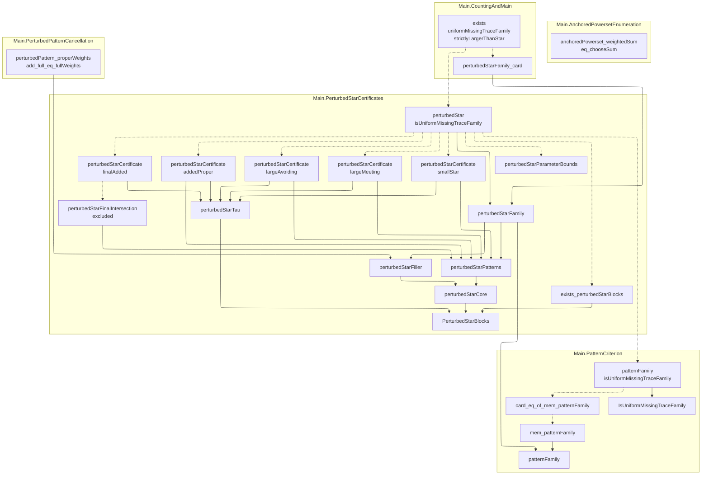

# Public API

- Repository completion: `graph_proved`
- Proof availability: `proved`
- Public declarations: `24` across `5` nodes

## Dependency graph

Consumers appear above the public declarations they depend on. Solid arrows are Statement dependencies; dashed arrows are Proof dependencies. Transitively implied edges are omitted for readability; each declaration page lists the complete direct dependency set. Mathlib and non-public project dependencies are not shown.

## Declarations

| Node | Declaration | Kind | Status |
| --- | --- | --- | --- |
| `Main.AnchoredPowersetEnumeration` | [`anchoredPowerset_weightedSum_eq_chooseSum`](public-api/main-anchoredpowersetenumeration-anchoredpowerset-weightedsum-eq-choosesum.md) | `theorem` | `proved` |
| `Main.CountingAndMain` | [`exists_uniformMissingTraceFamily_strictlyLargerThanStar`](public-api/main-countingandmain-exists-uniformmissingtracefamily-strictlylargerthanstar.md) | `theorem` | `proved` |
| `Main.CountingAndMain` | [`perturbedStarFamily_card`](public-api/main-countingandmain-perturbedstarfamily-card.md) | `theorem` | `proved` |
| `Main.PerturbedPatternCancellation` | [`perturbedPattern_properWeights_add_full_eq_fullWeights`](public-api/main-perturbedpatterncancellation-perturbedpattern-properweights-add-full-eq-fullweights.md) | `theorem` | `proved` |
| `Main.PerturbedStarCertificates` | [`perturbedStar_isUniformMissingTraceFamily`](public-api/main-perturbedstarcertificates-perturbedstar-isuniformmissingtracefamily.md) | `theorem` | `proved` |
| `Main.PerturbedStarCertificates` | [`exists_perturbedStarBlocks`](public-api/main-perturbedstarcertificates-exists-perturbedstarblocks.md) | `theorem` | `proved` |
| `Main.PerturbedStarCertificates` | [`perturbedStarCertificate_addedProper`](public-api/main-perturbedstarcertificates-perturbedstarcertificate-addedproper.md) | `theorem` | `proved` |
| `Main.PerturbedStarCertificates` | [`perturbedStarCertificate_finalAdded`](public-api/main-perturbedstarcertificates-perturbedstarcertificate-finaladded.md) | `theorem` | `proved` |
| `Main.PerturbedStarCertificates` | [`perturbedStarCertificate_largeAvoiding`](public-api/main-perturbedstarcertificates-perturbedstarcertificate-largeavoiding.md) | `theorem` | `proved` |
| `Main.PerturbedStarCertificates` | [`perturbedStarCertificate_largeMeeting`](public-api/main-perturbedstarcertificates-perturbedstarcertificate-largemeeting.md) | `theorem` | `proved` |
| `Main.PerturbedStarCertificates` | [`perturbedStarCertificate_smallStar`](public-api/main-perturbedstarcertificates-perturbedstarcertificate-smallstar.md) | `theorem` | `proved` |
| `Main.PerturbedStarCertificates` | [`perturbedStarFamily`](public-api/main-perturbedstarcertificates-perturbedstarfamily.md) | `definition` | `declared` |
| `Main.PerturbedStarCertificates` | [`perturbedStarFiller`](public-api/main-perturbedstarcertificates-perturbedstarfiller.md) | `definition` | `declared` |
| `Main.PerturbedStarCertificates` | [`perturbedStarFinalIntersection_excluded`](public-api/main-perturbedstarcertificates-perturbedstarfinalintersection-excluded.md) | `theorem` | `proved` |
| `Main.PerturbedStarCertificates` | [`perturbedStarParameterBounds`](public-api/main-perturbedstarcertificates-perturbedstarparameterbounds.md) | `theorem` | `proved` |
| `Main.PerturbedStarCertificates` | [`perturbedStarPatterns`](public-api/main-perturbedstarcertificates-perturbedstarpatterns.md) | `definition` | `declared` |
| `Main.PerturbedStarCertificates` | [`perturbedStarCore`](public-api/main-perturbedstarcertificates-perturbedstarcore.md) | `definition` | `declared` |
| `Main.PerturbedStarCertificates` | [`perturbedStarTau`](public-api/main-perturbedstarcertificates-perturbedstartau.md) | `definition` | `declared` |
| `Main.PerturbedStarCertificates` | [`PerturbedStarBlocks`](public-api/main-perturbedstarcertificates-perturbedstarblocks.md) | `structure` | `declared` |
| `Main.PatternCriterion` | [`patternFamily_isUniformMissingTraceFamily`](public-api/main-patterncriterion-patternfamily-isuniformmissingtracefamily.md) | `theorem` | `proved` |
| `Main.PatternCriterion` | [`IsUniformMissingTraceFamily`](public-api/main-patterncriterion-isuniformmissingtracefamily.md) | `definition` | `declared` |
| `Main.PatternCriterion` | [`card_eq_of_mem_patternFamily`](public-api/main-patterncriterion-card-eq-of-mem-patternfamily.md) | `theorem` | `proved` |
| `Main.PatternCriterion` | [`mem_patternFamily`](public-api/main-patterncriterion-mem-patternfamily.md) | `theorem` | `proved` |
| `Main.PatternCriterion` | [`patternFamily`](public-api/main-patterncriterion-patternfamily.md) | `definition` | `declared` |
