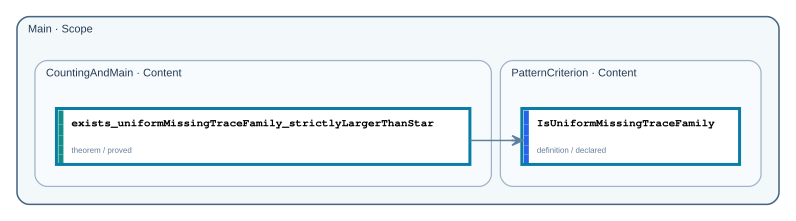

# Public API

- Repository format: `native`
- Repository completion: `graph_proved`
- Proof availability: `proved`
- Public declarations: `2` across `2` nodes

## Dependency graph

Arrows run from each consumer to the public declarations it depends on. Solid arrows are Statement dependencies; dashed arrows are Proof dependencies. Transitively implied edges are omitted for readability; each declaration page lists the complete direct dependency set. Mathlib and non-public project dependencies are not shown.

## Declarations

| Node | Declaration | Kind | Status |
| --- | --- | --- | --- |
| `Main.CountingAndMain` | [`exists_uniformMissingTraceFamily_strictlyLargerThanStar`](declarations/main-countingandmain-exists-uniformmissingtracefamily-strictlylargerthanstar.md) | `theorem` | `proved` |
| `Main.PatternCriterion` | [`IsUniformMissingTraceFamily`](declarations/main-patterncriterion-isuniformmissingtracefamily.md) | `definition` | `declared` |
