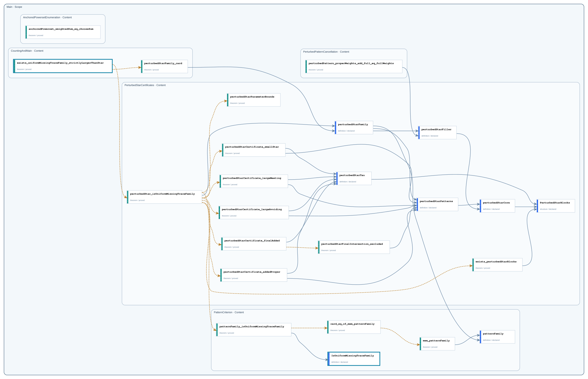

# Public Boundaries

This catalog shows every Content-public declaration and how it is selectively propagated through Scope boundaries. Only declarations exported through `Main` belong to the repository Public API.

- Content-public declarations: `24`
- Main exports: `2`

## Boundary graph

Solid gray arrows are Statement dependencies; dashed amber arrows are Proof dependencies. A thick teal declaration frame marks a Main export; compact upward labels record intermediate Scope exports.

## Declarations

| Node | Declaration | Kind | Status | Exported through | Main API |
| --- | --- | --- | --- | --- | --- |
| `Main.AnchoredPowersetEnumeration` | [`anchoredPowerset_weightedSum_eq_chooseSum`](declarations/main-anchoredpowersetenumeration-anchoredpowerset-weightedsum-eq-choosesum.md) | `theorem` | `proved` | — | no |
| `Main.CountingAndMain` | [`exists_uniformMissingTraceFamily_strictlyLargerThanStar`](declarations/main-countingandmain-exists-uniformmissingtracefamily-strictlylargerthanstar.md) | `theorem` | `proved` | `Main` | yes |
| `Main.CountingAndMain` | [`perturbedStarFamily_card`](declarations/main-countingandmain-perturbedstarfamily-card.md) | `theorem` | `proved` | — | no |
| `Main.PerturbedPatternCancellation` | [`perturbedPattern_properWeights_add_full_eq_fullWeights`](declarations/main-perturbedpatterncancellation-perturbedpattern-properweights-add-full-eq-fullweights.md) | `theorem` | `proved` | — | no |
| `Main.PerturbedStarCertificates` | [`perturbedStar_isUniformMissingTraceFamily`](declarations/main-perturbedstarcertificates-perturbedstar-isuniformmissingtracefamily.md) | `theorem` | `proved` | — | no |
| `Main.PerturbedStarCertificates` | [`exists_perturbedStarBlocks`](declarations/main-perturbedstarcertificates-exists-perturbedstarblocks.md) | `theorem` | `proved` | — | no |
| `Main.PerturbedStarCertificates` | [`perturbedStarCertificate_addedProper`](declarations/main-perturbedstarcertificates-perturbedstarcertificate-addedproper.md) | `theorem` | `proved` | — | no |
| `Main.PerturbedStarCertificates` | [`perturbedStarCertificate_finalAdded`](declarations/main-perturbedstarcertificates-perturbedstarcertificate-finaladded.md) | `theorem` | `proved` | — | no |
| `Main.PerturbedStarCertificates` | [`perturbedStarCertificate_largeAvoiding`](declarations/main-perturbedstarcertificates-perturbedstarcertificate-largeavoiding.md) | `theorem` | `proved` | — | no |
| `Main.PerturbedStarCertificates` | [`perturbedStarCertificate_largeMeeting`](declarations/main-perturbedstarcertificates-perturbedstarcertificate-largemeeting.md) | `theorem` | `proved` | — | no |
| `Main.PerturbedStarCertificates` | [`perturbedStarCertificate_smallStar`](declarations/main-perturbedstarcertificates-perturbedstarcertificate-smallstar.md) | `theorem` | `proved` | — | no |
| `Main.PerturbedStarCertificates` | [`perturbedStarFamily`](declarations/main-perturbedstarcertificates-perturbedstarfamily.md) | `definition` | `declared` | — | no |
| `Main.PerturbedStarCertificates` | [`perturbedStarFiller`](declarations/main-perturbedstarcertificates-perturbedstarfiller.md) | `definition` | `declared` | — | no |
| `Main.PerturbedStarCertificates` | [`perturbedStarFinalIntersection_excluded`](declarations/main-perturbedstarcertificates-perturbedstarfinalintersection-excluded.md) | `theorem` | `proved` | — | no |
| `Main.PerturbedStarCertificates` | [`perturbedStarParameterBounds`](declarations/main-perturbedstarcertificates-perturbedstarparameterbounds.md) | `theorem` | `proved` | — | no |
| `Main.PerturbedStarCertificates` | [`perturbedStarPatterns`](declarations/main-perturbedstarcertificates-perturbedstarpatterns.md) | `definition` | `declared` | — | no |
| `Main.PerturbedStarCertificates` | [`perturbedStarCore`](declarations/main-perturbedstarcertificates-perturbedstarcore.md) | `definition` | `declared` | — | no |
| `Main.PerturbedStarCertificates` | [`perturbedStarTau`](declarations/main-perturbedstarcertificates-perturbedstartau.md) | `definition` | `declared` | — | no |
| `Main.PerturbedStarCertificates` | [`PerturbedStarBlocks`](declarations/main-perturbedstarcertificates-perturbedstarblocks.md) | `structure` | `declared` | — | no |
| `Main.PatternCriterion` | [`patternFamily_isUniformMissingTraceFamily`](declarations/main-patterncriterion-patternfamily-isuniformmissingtracefamily.md) | `theorem` | `proved` | — | no |
| `Main.PatternCriterion` | [`IsUniformMissingTraceFamily`](declarations/main-patterncriterion-isuniformmissingtracefamily.md) | `definition` | `declared` | `Main` | yes |
| `Main.PatternCriterion` | [`card_eq_of_mem_patternFamily`](declarations/main-patterncriterion-card-eq-of-mem-patternfamily.md) | `theorem` | `proved` | — | no |
| `Main.PatternCriterion` | [`mem_patternFamily`](declarations/main-patterncriterion-mem-patternfamily.md) | `theorem` | `proved` | — | no |
| `Main.PatternCriterion` | [`patternFamily`](declarations/main-patterncriterion-patternfamily.md) | `definition` | `declared` | — | no |
